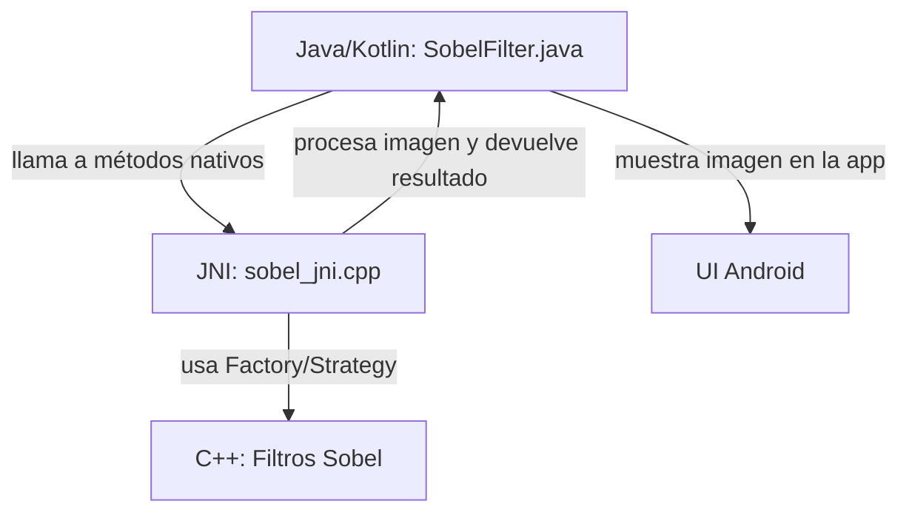

# 📱 Tutorial Visual: Flujo Android NDK/JNI

> **Nota:** Este documento contiene el tutorial visual y explicación del flujo Android NDK/JNI para referencia futura. No es parte del README principal.

## 🎯 Propósito

Este tutorial explica cómo se integraría el código C++ con Android NDK/JNI, aunque no se haya implementado la app Android completa.

## 📊 Diagrama del Flujo



## 🔄 Explicación Paso a Paso

1. **El usuario selecciona una imagen en la app Android.**
2. **La imagen se convierte a un array de bytes (`byte[]`).**
3. **La app llama a los métodos nativos de la clase `SobelFilter` (Java/Kotlin):**
   - `createFilter(String tipo)`
   - `processImage(long id, byte[] input, int width, int height)`
   - `destroyFilter(long id)`
4. **El código JNI (`sobel_jni.cpp`) recibe la llamada, crea el filtro adecuado usando Factory/Strategy, procesa la imagen y devuelve el resultado como `byte[]`.**
5. **La app convierte el resultado a un `Bitmap` y lo muestra en pantalla.**

## 💻 Ejemplo de Uso en Java/Kotlin

```java
// Crear filtro
long filterId = sobelFilter.createFilter("sobel_improved");

// Procesar imagen (inputBytes es el array de la imagen, width y height sus dimensiones)
byte[] resultBytes = sobelFilter.processImage(filterId, inputBytes, width, height);

// Convertir a Bitmap y mostrar en la UI
Bitmap resultBitmap = BitmapFactory.decodeByteArray(resultBytes, 0, resultBytes.length);
imageView.setImageBitmap(resultBitmap);

// Liberar filtro
sobelFilter.destroyFilter(filterId);
```

## 📁 Archivos Relacionados

- `android/sobel_jni.cpp` - Puente JNI
- `android/CMakeLists.txt` - Configuración para compilar librería nativa
- `include/filter_factory.h` - Factory Pattern para crear filtros
- `include/edge_detection_strategy.h` - Strategy Pattern para algoritmos

## 🔗 Integración con Android Studio

1. **Copiar archivos C++** a `app/src/main/cpp/`
2. **Configurar CMake** en `app/build.gradle`
3. **Crear clase Java/Kotlin** que llame a los métodos nativos
4. **Compilar librería nativa** (`libsobel.so`)
5. **Usar en la UI** de la app Android

---

*Documento creado para referencia técnica y explicación en entrevistas.* 